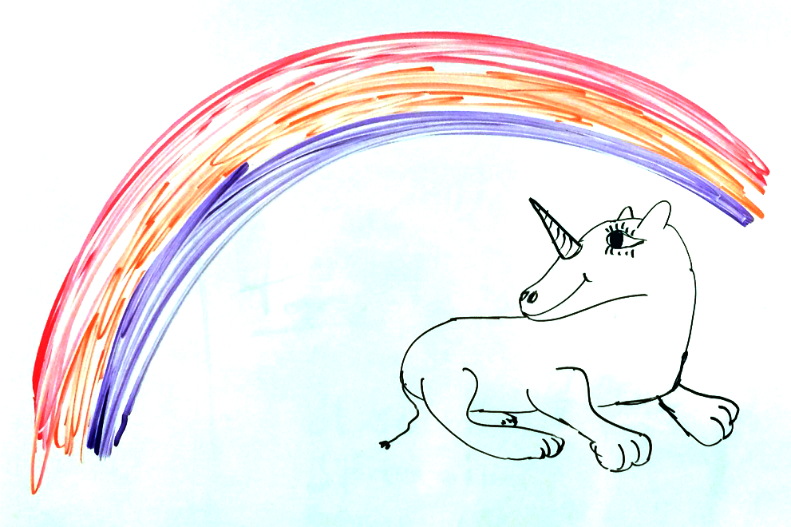

:doc:`Home <../index>` / :doc:`index`

====================
The ``Reject`` Node
====================

Sometimes it makes sense to terminate an interview prematurely. For these cases, PolicyModels has a ``reject`` node. When the runtime gets to a ``reject`` node, the interview stops, and the rejection reason is presented to the user.

Consider a data tagging system that matches a data handling policy to a dataset. Theoretically, every dataset should have a matching policy. The reality is a bit more complex: there is a special case. Datasets that were obtained by violating laws or regulations cannot be automatically accepted to repositories (if at all).

---------------------
It's Not Us, Its You
---------------------

A ``reject`` node has a textual body, explaining the rejection reason. They look like this:

.. code ::

  [reject: Data cannot be accepted.
           It is illegal to gather data by hunting down baby unicorns.]

  Baby unicorn (illustration by the author)

In the following questionnaire (files: :download:`tag space<code/reject/education.ts>`, :download:`decision graph<code/reject/education.dg>`), the interview starts with a short validation of the legality of the dataset. If the dataset is, indeed, legal, the interview continues. Otherwise, it ends on the ``reject`` node at line 21.

.. literalinclude :: code/reject/education.dg
  :emphasize-lines: 21-22
  :linenos:

.. warning :: This questionnaire is, of course, is intended to show the usage of the ``reject`` node. NOT TO BE USED AS LEGAL ADVICE.

.. figure :: img/education.png

  The education interview.

.. figure :: img/rejection.png

  Rejection message from the DataTaggingServer, due to a likely PPRA violation.

:doc:`Next up<consider>`, we'll demonstrate how to use the current slot values to conditionally visit parts of the decsion graph.
