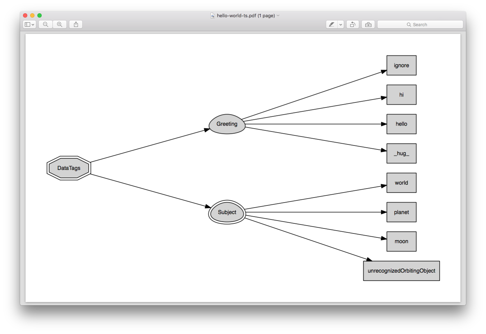

:doc:`index`

==================
Hello, World! v1.0
==================

Let's start with a simple "hello, world!" questionnaire. A questionnaire consists of two components:

* Tag Space: Defines the tags the questionnaire can assign, and their possible values. The tag space is defined in a separate file, normally with a ``.ts`` suffix.
* Decision Graph: Describes a decision graph. Nodes carry instruction to a runtime engine, that traverse the graph along its edges. Decision graph files often have a ``.dg`` suffix.

---------
Tag Space
---------

This being a "hello world" program, we need tags to allow us to greet the world (:download:`hello-world.ts <code/hello-world/hello-world.ts>`):

.. code::

   DataTags: consists of Greeting, Subject.
   Greeting: one of ignore, hi, hello, _hug_.
   Subject: some of World, Planet, Moon, UnrecognizedOrbitingObject.

Line 1 defines the ``DataTags`` :doc:`/tag-spaces/compound-slot`. Currently, the top-level slot must be called *DataTags*. As defined in *hello-world.ts*, ``DataTags`` has two sub-slots: ``Greeting`` and ``Subject``.
``Greeting`` is an :doc:`/tag-spaces/atomic-slot` - it is defined using ``one of``. It can be empty, or contain ``ignore``, ``hi``, ``hello``, or ``congratulations``. The order in which those terms are defined is important; we'll get to this later.
``Subject`` is what we greet. Since we're not limited to one - it makes sense to say "hello" to the world AND the moon - ``Subject`` is an :doc:`/tag-spaces/aggregate-slot`, defined using ``some of``.

----------------
Decision Graph
----------------

Now that we have a tag space, we can create a process to decide on a specific tag within that space - that's what the Decision Graph file is for. Our mission is clear: we need to final tags to have ``hello`` in ``Greeting``, and ``world`` in ``Subject``. Here is the graph (:download:`hello-world.dg <code/hello-world/hello-world.dg>`)::

[set: Greeting=hello]
[set: Subject+=world]

This graph contains two ``set`` nodes, each one setting the value of a different slot. Note that since ``Subject`` contains a collection of values, the Tags language uses ``+=`` rather than ``=``. If ``Subject`` contained other values, these values will not change when going through the ``set`` node.

``Greeting`` is a different story. Being an atomic slot, it can only contain a single value. Thus, if is had any value in it, the ``set`` node in line 1 may remove is and put ``hello`` instead. There are cases when this ``set`` instruction will be ignored; we'll get to this :doc:`later <value-order>`.

------------------
Model Description
------------------

Last step before running the model: create the policy model metadata file. This is an XML file defining which file defines the policy space and which one defines the main decision graph. Additionally, this file contains metadata describing the title, authors, references, etc. By convension, this file is called ``policy-model.xml``, but it can have any name (:download:`policy-model.xml<code/hello-world/policy-model.xml>`).

.. include :: code/hello-world/policy-model.xml
   :code:
   :number-lines:

---------
Runtime!
---------

Now, let's run the questionnaire. In the console, type the following::

  java -jar DataTagsLib path/to/policy-model.xml

or just::

  java -jar DataTagsLib

and provide the path to ``policy-model.xml`` when CliRunner prompts you.

.. tip:: On most systems, dragging a file to the terminal's window will type its absolute path in the prompt.

.. tip:: If the model description file is indeed called ``policy-model.xml``, it is enough to provide the path to the model's directory. CliRunner will find the description file automatically. 

The system traverses the graph and setting the slot values like so:

.. code::

  # Run Started
  # Updating tags
  # DataTags/Greeting = hello
  # Updating tags
  # DataTags/Subject = world

  ~~~~~~~~~~
  Final Tags
  ~~~~~~~~~~
  DataTags/Greeting = hello
  DataTags/Subject = world
  Command (? for help):

The run terminates on its own, as there are no questions. The CliRunner prints the final tags, and now waits for our command.
Let's look around a bit, then.

You can type ``?`` at the prompt and get the list of commands. To see what the engine went through will traversing the graph, type ``\trace`` (commands always start with ``\``, to distinguish them from answers). CliRunner responds with:

.. code::

  [>[#1]< set]
  [>[#2]< set]
  [>[SYN-END]< end]

There are two interesting things about this printout. First, all the nodes have ids (that's the part inside the ``>`` ``<``), even though they didn't have ids in the code. Second, there are three nodes - an :doc:`/decision-graphs/end-node` was added at the end.

The ids were given to the nodes by the compiler. They can be thought of as "Miranda Ids" - if you don't have an id, the compiler will provide one for you. It's easy to know when an id is a Miranda id: it contains ``[`` and ``]``. A program cannot use these characters in an id, as it would lead to a syntax error. This way, no collisions can occur between Miranda and programmed node ids. It's useful to have these ids, as it allows the user to refer to them at the prompt. Try typing ``\show-node [#1]`` and see what happens.

As for the extra end node, it is also automatically added by the compiler. End nodes are used to tell the engine to stop the current graph traversal - they are the equivalents of a ``return`` statement in other languages. As this end node is in the top level, when the engine gets to it, the run terminates.

---------------
Visualizations
---------------

Some people find it easier to reason about decison graphs when they are displayed as, well, graphs. CliRunner offers this functionality, providing that Graphviz is installed. Type ``\visualize-dg`` at the prompt. CliRunner will prompt for a filename to save the visualization to, and possibly for a path to ``dot``, the Graphviz executable used. Similarly, ``\visualize-ts`` will create a tree view of the tag space.

.. figure:: img/visualize-dg.png

  The result of ``visualize-dg`` - a drawing of the decision graph, in a PDF file.

  The result of ``visualize-ts``.

Congratulations! You've finished your first questionnaire! To achive this, you have:

  * Created a tag space out of three types of slots: :doc:`/tag-spaces/compound-slot`, :doc:`/tag-spaces/aggregate-slot` and :doc:`/tag-spaces/atomic-slot`,
  * Created a decision graph with :doc:`set nodes </decision-graphs/set-node>`,
  * Looked at its trace and its nodes, and
  * Visualized the decision graph and the tag space.

When you're ready, you can take the next tutorials, starting with :doc:`hello-world-revisited`.
