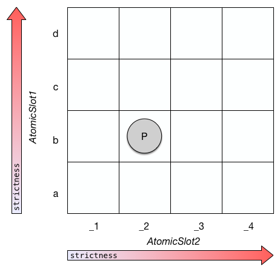
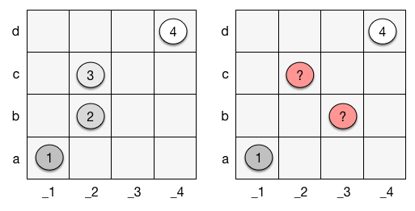
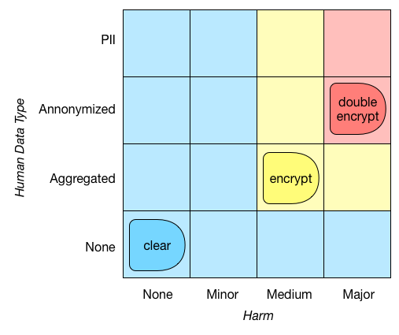
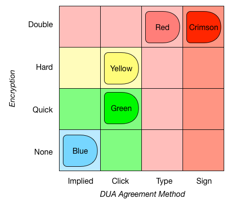

:doc:`index`

====================
Value Inference
====================

Here's a common requirement: "whenever a dataset contains harmful data about specific humans, it has to be encrypted". This statement should hold regardless of the answers given during the interview. Another common requirement is "a system has 4 service levels, always find the most appropriate level for a given situation". PolicyModles implements such requirements using a machanism called *Value Inferrerence*. Using value inference make these requirements explicit (and thus easier to understand and debug) and keeps the decision graph smaller, as it does not have to implement said requirements at each one of its paths.

``ValueInferrer``\s infer the value of an :doc:`atomic slot<../tag-spaces/atomic-slot>` based on a set of values in another slots. There are two inference types: ``compliance`` and ``support``. This is an advanced feature that allows concise and easy to read descriptions of the interconnections between various values in a policy space. It does require a little theory, though.

A Little Theory: Policy Spaces
------------------------------

We can view a policy space, as defined in PolicyModels, as a multi-dimentional discrete space, where the axes are :doc:`atomic slot<../tag-spaces/atomic-slot>`\s [#]_. When a policy space has only two atomic slots, it can be visualized as a table, like so:

   A policy space with two atomic slots. Point ``p`` is a compound value with value ``b`` at its ``AtomicSlot1`` slot, and value ``_2`` at its ``AtomicSlot2`` slot.

Each point in a policy space is a policy. Each policy defines two sub-spaces:

Compliance sub-space:

  Contains all the policies that are equal or stricter than a given policy. All these policies comply with said policy. For example, if a policy allows a dataset to be stored un-encrypted, it is OK to encrypt it.

Support sub-space:

  Contains all the policies that a given policy does not breach. Or, all the policies whose compliance sub-space contains said policy.

Note that some parts of the policy space are in neither of these spaces. This makes sense: it's easy to come up with two policies, where one is stricter than the other on some aspects, and more lenient on others.

.. figure:: img/spaces/sub-spaces.png
   :align: center

   Point ``p`` and its two sub-spaces, ``compliance(p)`` and ``support(p)``. Note the gray parts - they contain the policies that are not stricter nor more lenient than ``p``.

A series of coordinates in policy space imply a set of hierarchical sub-spaces, which is a property we'll use for value inference (we're getting there!). But not every series creates such a set of spaces - each point has to be in it's former's compliance space (see below).

   Two sets of policies. The set on the left creates a set of hierarchical sub-spaces, while the set on the right does not: it is ambiguous which point is #2 and which #3 in the hierarchy.

.. tip :: To learn more about policy spaces and the sub spaces they define, the reader is referred to the 2016 technical DataTags paper, `Data Handling Policy Spaces and the Tags Language`_.

Support vs. Compliance Matching
----------------------------------

Given a hierarchical set of policies, and a point in policy space that's not part of that set -- how can we decide which point in the set is the most fitting for said point? There are two options, and so the answer is "it depends".

Compliance-Based Inference
~~~~~~~~~~~~~~~~~~~~~~~~~~

One option can be illustrated by the following statement:

  If a dataset can cause at least medium harm, and contains aggregated (or more detailed) human data, encrypt it. If it can cause major harm and the data is annonymized (or contains personally identifying information), use double encryption. Otherwise, store it in the clear.

This type of requirement can be visualized like below. In policy space terms, given a set of points (here ``(None,None)``, ``(Medium,Aggregated)`` and ``(Major,Annonymized)``), we map any point in the policy space to the strictest policy whose compliance space contains said point. So, the policy/point ``(Medium,Annonymized)`` would map to ``(Medium,Aggregated)``. That's a lot of math-speak for saying something quite intuitive: if we require the encryption of datasets that can cause medium harm and contain aggregated data, we should require the encryption of datasets that can cause more harm, or whose data is more detailed.

  Hierarchical sub spaces with compliance matching. This type of matching pairs an arbitrary point/policy ``p`` with the strictest policy in the hierarchy whose compliance space contains ``p``.

.. note:: This text and the included examples aim to present PolicyModel's ``ValueInferrer``\s, not to suggest proper data handling policies. In this discussion, we ignore the question of assessing the harm a dataset may cause or how effective annonymization is (hint: not *that* effective). It is also probably a good idea to encrypt data that can cause "major harm" regardless of whether it pertains to humans or not; but that would make the example less clear.

This type of value inference is defined in PolicyModels like so:

.. literalinclude :: code/InferrerExample/valueInference.vi
   :linenos:

Support-Based Inference
~~~~~~~~~~~~~~~~~~~~~~~

Another option is to base the matching on support spaces. This is useful, for example, when there's a set of implemented support levels, and you want your model to choose the most appropriate one. `DataTags`_ springs to mind, of course (PolicyModels started as a toolchain for implementing DataTags), but it's easy to think of other cases as well. Here's an example set of DataTags, using two handling options: Encryption, and DUA agreement method (which is how a user agrees to the data use agreement of a given dataset).

   Hierarchical sub-spaces with support matching. This type of matching pairs an arbitrary point/policy ``p`` with the most lenient point of the hierarchy, whose support space contains ``p``.

Suppose, using the above example, an interview concludes that a given dataset does not have to be encrypted, and requires a user to agree to a DUA using a click-through method. There is no DataTag at ``(None,Click)``, and so the data depositor has to decide between the Blue and Yellow tags. But the Blue tag is not a real option - if the depositor would have chosen it, people downloading the dataset will not go through a click-through agreement process. Thus, the only option is the Yellow tag - it would unnecessarily encrypt the data, but will not breach any law. In effect, support matching makes a model err on the safe side.

.. note:: For a realistic set of DataTags, please refer the `original DataTags paper`_ or to http://datatags.org..

Implementing the above example in PolicyModels code:

.. literalinclude :: code/InferrerExample/valueInference-sup.vi
   :linenos:

Adding Inferres to a Model
--------------------------

Finally, we arrive at the technical part. In order to add a set of value inferrers to a policy model, add a value inferres file to the model folder. This is a regular text file containing the inferrers code (as described above). No need to add commas or semicolons between inferrers (informative comments are always a good idea, though!). Finally, make the model aware of the inferrers file by adding a ``<valueInferrer>`` node to *policy-model.xml*, as in line 8 below:

.. literalinclude :: code/InferrerExample/policy-model.xml
   :emphasize-lines: 8
   :linenos:

Technical points:

* An atomic slot may have more than one inferrer inferring it.
* Similar to ``[set]`` nodes, a ``valueInferrer`` cannot make a value more lenient. Suppose a ``DataTag`` slot was set to ``Red``, an inferrer cannot make it ``Blue``. Such an inference is not an error, and the PolicyModels runtime will just silently ignore it.
* Whenever the PolicyModels runtime applies a ``[set]`` node, it uses all the model's ``ValueInferrer``\s to further update the value, if needed. It keeps invoking the inferrers until there are no more updates to the current policy (note that becuase of the former bullet point, this process cannot go on forever).

.. _Data Handling Policy Spaces and the Tags Language: https://doi.org/10.1109/SPW.2016.11
.. _DataTags: http://datatags.org
.. _original DataTags paper: http://techscience.org/a/2015101601

.. [#] Other types of slots are transleted to atomic slots, for this to fully work. See `technical paper`_ for full algorithmic description.

.. _technical paper: https://doi.org/10.1109/SPW.2016.11
