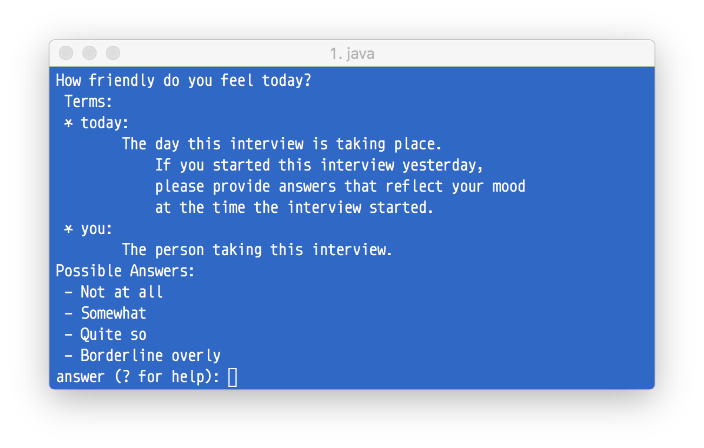
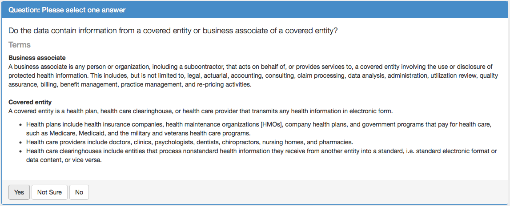

:doc:`index`

===============
Hello? World?
===============

So far, we've put values into slots without asking the user for any information. That is, of course, not the common case. When we need to ask a user, Tags offers the ``ask`` node:

.. include:: code/hello-question-world/hello-question-world.dg
   :code:

The parts between ``{`` and ``}`` in the above ``ask`` node are *sub-nodes* - they can only live within other nodes, and are used to create their structure. This ``ask`` node has a ``text`` sub-node, which has the text for the question, an ``answers`` sub-node, containing the possible answers. Each of ``answers``' sub-nodes contain the answer text, and a list of top-level nodes (a single ``set`` node, in this case).

The the questionnaire runtime traverses an ``ask`` node as follows:

#. Gets to the ask node.
#. Waits until an answer is selected
#. Traverses the node list of the selected answer
#. If the traversal was not terminated (i.e. no :doc:`end</decision-graphs/end-node>` or :doc:`reject </decision-graphs/reject-node>` nodes were encountered), continues to the node after said ``ask`` node.

.. figure:: img/hello-question-world.png

  Visualization for the above decision graph (``\visualize-dg``)

.. note:: Separating the answer text from its implementation (i.e. its list of nodes) allows for a separation between what answers the users see, and how the questionnaire handles their answers. You can ask the users in terms they understand, and process the answers in term that are convenient for you.

Run the questionnaire (here are the files for the :download:`tag space <code/hello-question-world/hello-question-world.ts>` and the :download:`decision graph <code/hello-question-world/hello-question-world.dg>`). The CLiRunner compiles the questionnaire, prompts the user with the question, and then sets the greeting according to her current friendliness.

.. code::

  # Run Started
  How friendly do you feel today?
  Possible Answers:
  - Not at all
  - Somewhat
  - Quite so
  - Borderline overly
  answer (? for help): Somewhat
  # Updating tags
  # DataTags/Greeting = hi
  # Updating tags
  # DataTags/Subject = world

  ~~~~~~~~~~
  Final Tags
  ~~~~~~~~~~
  DataTags/Greeting = hi
  DataTags/Subject = world

-------------
Terms
-------------

Real-world questions are likely to contain unfamiliar terms, especially when the questions are about legal matters, and the intended audience have had little or no legal training. To clarify terms that appear in a question's ``{text:}``, Tags offers the ``{terms}`` sub-node.

.. include:: code/hello-question-world/ask-with-terms.dg
   :code:

The terms are displayed to the user along with the question's text.

  The terms, as displayed by CLiRunner

  DataTaggingServer showing a question mentioning *Business Associate* and *Covered Entity*, as defined under `HIPAA <https://en.wikipedia.org/wiki/Health_Insurance_Portability_and_Accountability_Act>`_.

--------------------
Yes/No Special Case
--------------------

While working on Tags, we found a repeating interview pattern: The user is asked a yes/no question. On one option (typically a "yes"), the interview goes through a serious of questions before proceeding to the node pointed by the other option (typically, a "no"). To naturally support this, *if an ask node contains only a single "yes" or "no" answer, the other answer is implied, and leads to the next node following that ask node*.

In the :download:`below decision graph <code/hello-question-world/hello-implied-world.dg>`, the user may decide to greet other subjects.

.. include:: code/hello-question-world/hello-implied-world.dg
   :code:

.. figure:: img/implied-flow-annotated.png

  The above code, visualized. Implied edges are pointed by arrows.

Now that you've leanred to ask questions and set slot values according to the user's choices, you can start writing questionnaires! But you your training is not complete; there are :doc:`more nodes to be discovered <call-and-end>`.
