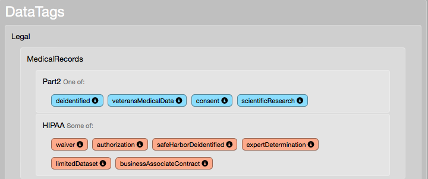

:doc:`index`

======================
Hello World, Revisited
======================

In the :doc:`previous tutorial<hello-world-1>`, we have created a simple questionnaire. Let's revisit that questionnaire, and see what could be improved.

More About the ``set`` Node
------------------------------

``set`` nodes can set more than a single value. Assignments are separated by ``;``. So this program:

.. include:: code/hello-world/hello-world.dg
   :code:

is equivalent to this one:

.. include :: code/hello-world/hello-world-multiset.dg
   :code:

Try this: run the questionnaire you've made in the previous tutorial. Now, merge the set nodes. At the prompt, type ``\reload``.

The runtime reloads the questionnaire, and executes it. If you look at the trace (that's ``\trace``, remember?) you'll see only a single ``set`` node was used.

.. tip:: While developing a questionnaire, it is handy to keep a CliRunner running and performing a ``\reload`` once in a while. This allows for early detection of structural and syntactic errors.

In order to assign multiple values to an aggregate slot, separate the slots using a comma (``,``)::

[set: Greeting=_hug_; Subject += world, moon ]

Finally, the slot name can be compound, that is ``DataTags/Greeting``, not just ``Greeting``. While that's not useful here, as the tag space gets more complex this can help. Here's a path from a real-life [#f1]_ questionnaire::

  DataTags/Handling/DUA/Publication

However, if a suffix of a given slot is unique, the system will automatically resolve it to an absolute slot name. For example, If there are no other slots whose full path ends with ``Publication``, these lines are equivalent::

[set: DataTags/Handling/DUA/Publication=PreApprove ]
[set: Handling/DUA/Publication=PreApprove ]
[set: DUA/Publication=PreApprove ]
[set: Publication=PreApprove ]

Adding Notes to Slots and Values
---------------------------------

A DataTags system should be user-friendly, and thus cannot assume its user knows everything about each tag. Therefore, Tags allows adding notes to slot and values. Unlike code comments, the notes make it to the compiled questionnaire, and thus can be displayed to the user when necessary.

Notes are added as text between ``[`` and ``]``, at the definition point of the slot. Below is the "hello world" tag space definitions, with notes added:

.. include:: code/hello-world/hello-world-annotated.ts
   :code:

Note that:

* Whitespace characters (new lines, tabs, spaces) can be used to format the tag definition so that it's more pleasent to read.
* Slot definitions span several lines, so they are easier to read.
* Adding notes in not an all-or-nothing decision: some slots can have them, while others do not.

When running the questionnaire with the :download:`new definitions file <code/hello-world/hello-world-annotated.ts>`, when the user types the command ``\show-slot <slot name>``, they can get useful information about the slot, like so ::

  Command (? for help): \show-slot Greeting
  Greeting: atomic slot (one of)
  Type of greeting to perform
  Possible values:
  * ignore
    The null greeting
  * hi
    Acknowledging the other person, but not really stopping for a chat
  * hello
    Friendly greeting
  * _hug_
    Physically hugging the other person

A real-life usage of notes of note, can be found in the DataTaggingServer, CliRunner's web equivalent. Tag values with notes have an "info" icon, displaying the note when the user hovers over it.

  Screen capture of the DataTaggingServer UI showing values with notes...

.. figure:: img/slot-note-popover.png

    ...and when the users hovers over the information icon.

Comments
--------

Like most programming languages, Tags has two types of comments: end-of-line, and block. End-of-line comments extend from the first ``<--``, to the end of the line, like so::

  [set: HIPAA += limitedDataset ] <-- a statement about this line

Block comments are contained in ``<*`` and ``*>``, like so::

  [set: SomeSlot=aValue ]
  <* This part of the questionnaire should cover HIPAA's recent amendments,
     especially the parts that pertain to .....
     ....
     ....
     *>
  [set: SomeOtherSlot = bValue ]

Both block and line comments can be used in tag space definitions as well::

  <* Slot for the receiver of the greeting, added
   * to solve issue #12345
   *>
  Subject [Who will be greeted]: some of
    world [Planet Earth],
    planet [Any planet.],
    moon, <-- That's no moon!
    unrecognizedOrbitingObject [Hopefully they're friendly].

What's Next
------------

Now that you've mastered the ``set`` nodes, notes, and comments, it's time to start asking questions. On to :doc:`hello-question-world`.

.. rubric:: Footnotes

.. [#f1] A preliminary questionnaire developed by The Data Privacy Lab, the Institute for Quantitative Social Science and the Berkman Center for Internet and Society, at Harvard. This questionnaire covers nine federal laws, including HIPAA, FERPA, PPRA, CIPSEA, and DPPA. `Questionnaire site <http://dvnweb-vm1.hmdc.harvard.edu/interviews/dds-c1/intro>`_
