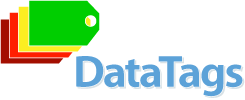

ifndef::env-github[:icons: font]
ifdef::env-github[]
:status:
:outfilesuffix: .adoc
:caution-caption: :fire:
:important-caption: :exclamation:
:note-caption: :page_with_curl:
:tip-caption: :bulb:
:warning-caption: :warning:
endif::[]
== DataTags Language Tools

Part of the http://datatags.org[DataTags] project, this library contains
tools for the DataTags Decision Graph language, used to create
questionnaires and tag spaces. Here you can find:

http://datatagginglibrary.readthedocs.io/[image:http://readthedocs.org/projects/datatagginglibrary/badge/?version=latest[Documentation
Status]]
https://travis-ci.org/IQSS/DataTaggingLibrary[image:https://travis-ci.org/IQSS/DataTaggingLibrary.svg?branch=develop[Build
Status]]

* link:src/edu/harvard/iq/datatags/parser[Language Parsers]
* link:src/edu/harvard/iq/datatags/runtime/RuntimeEngine.java[Embeddable
runtime engine]
* link:src/edu/harvard/iq/datatags/visualizers/graphviz[Visualization
tools]
* link:src/edu/harvard/iq/datatags/tools[Validation tools]
* link:src/edu/harvard/iq/datatags/mains/DecisionGraphCliRunner.java[Command-line
decision graph runner].
* link:WORK/policy-models[Sample Models].

[NOTE]
DataTags is part of the http://privacytools.seas.harvard.edu[Privacy
Tools for Sharing Research Data] project. The code in this repository is
a http://maven.apache.org[maven] project.
